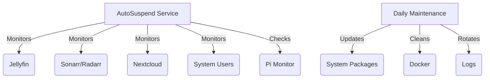

# MediaServer AutoSuspend

[](https://opensource.org/licenses/MIT)
[](https://www.python.org/downloads/)
[](https://github.com/pirelike/mediaserver-autosuspend/issues)

MediaServer AutoSuspend is an intelligent power management solution for home media servers. It provides automated service monitoring, power state management, and system maintenance while integrating with a Wake-on-LAN monitor for seamless remote access.

## 🌟 Key Features

### Service Monitoring
- Real-time monitoring of:
  - Jellyfin media sessions
  - Sonarr and Radarr download queues
  - Nextcloud system activity
  - User sessions
  - External web traffic (via Raspberry Pi monitor)

### Power Management
- Configurable idle detection
- Graceful system suspension
- Automatic wake-up scheduling
- Wake-on-LAN support

### System Maintenance
- Automated system updates
- Docker system cleanup
- Log rotation
- Configurable maintenance windows
- Safe system restarts

### Technical Features
- YAML-based configuration
- Thread-safe logging with rotation
- Single-instance enforcement
- Comprehensive status reporting
- Extensible service monitoring framework

## 📋 Requirements

### Server Requirements
- Ubuntu Server 20.04+ (recommended) or other Linux distribution
- Python 3.8 or higher
- Systemd
- Wake-on-LAN capable network interface

### Required Services
- Jellyfin (for media streaming)
- Sonarr (for TV show management)
- Radarr (for movie management)
- Nextcloud (for file hosting)
- Docker (optional, for containerized services)

### Network Requirements
- Static IP address for server
- Raspberry Pi running [Autowake](https://github.com/pirelike/autowake)
- Local network that allows Wake-on-LAN packets

## 🚀 Quick Start Installation

For those who want to get up and running quickly, follow these simplified installation steps. For detailed configuration options, see the [Advanced Configuration](#advanced-configuration) section.

### 1. System Preparation
```bash
# Update system
sudo apt update && sudo apt upgrade -y

# Install dependencies
sudo apt install -y python3 python3-venv python3-pip git
```

### 2. Directory Setup
```bash
# Create installation directory
sudo mkdir -p /home/mediaserver/scripts
sudo chown -R $USER:$USER /home/mediaserver/scripts
```

### 3. Installation
```bash
# Clone repository
git clone https://github.com/pirelike/mediaserver-autosuspend.git
cd mediaserver-autosuspend

# Create virtual environment
python3 -m venv /home/mediaserver/scripts/venv
source /home/mediaserver/scripts/venv/bin/activate

# Install requirements
pip install -r requirements.txt

# Copy files
sudo cp scripts/autosuspend.py /home/mediaserver/scripts/
sudo cp scripts/daily_maintenance.py /usr/local/bin/
sudo cp config/*.yaml.example /home/mediaserver/scripts/
```

### 4. Basic Configuration
```bash
# Rename example configs
cd /home/mediaserver/scripts
mv autosuspend_config.yaml.example autosuspend_config.yaml
mv maintenance_config.yaml.example maintenance_config.yaml

# Edit configuration
nano autosuspend_config.yaml
```

### 5. Service Setup
```bash
# Copy service files
sudo cp services/* /etc/systemd/system/

# Set permissions
sudo chmod +x /home/mediaserver/scripts/autosuspend.py
sudo chmod +x /usr/local/bin/daily_maintenance.py

# Enable services
sudo systemctl daemon-reload
sudo systemctl enable autosuspend daily-maintenance.timer
sudo systemctl start autosuspend daily-maintenance.timer
```

## 🔧 Advanced Configuration

### AutoSuspend Configuration
```yaml
jellyfin:
  api_key: "your-jellyfin-api-key"
  url: "http://localhost:8096"
  check_interval: 30

monitoring:
  grace_period: 600
  check_interval: 30
  required_failures: 2
  required_successes: 2

power:
  wol_interface: "eth0"
  suspend_command: "systemctl suspend"
```

### Maintenance Configuration
```yaml
maintenance:
  grace_period: 60
  docker_prune: true
  log_retention_days: 7
  restart_delay: 5

updates:
  security_only: false
  auto_restart: true
```

## 📊 System Architecture



## 🔍 Monitoring and Logs

### Service Status
```bash
# Check AutoSuspend status
systemctl status autosuspend

# Check maintenance timer
systemctl list-timers daily-maintenance.timer
```

### Log Viewing
```bash
# View AutoSuspend logs
journalctl -u autosuspend -f

# View maintenance logs
tail -f /home/mediaserver/scripts/daily_maintenance.log
```

## 🛠️ Troubleshooting

### Service Diagnostics
```bash
# Check system state
systemctl status autosuspend

# View detailed logs
journalctl -u autosuspend -n 100 --no-pager

# Test WoL functionality
wakeonlan -i 192.168.1.255 XX:XX:XX:XX:XX:XX
```

### Common Issues

1. Service Won't Start
   - Check Python dependencies
   - Verify configurations
   - Check permissions

2. Server Won't Sleep
   - Check service activity
   - Verify grace period
   - Check logs for active sessions

3. Wake-up Issues
   - Verify BIOS settings
   - Check network configuration
   - Test WoL packets

## 🤝 Contributing

We welcome contributions! See our [Contributing Guide](https://github.com/pirelike/mediaserver-autosuspend/blob/main/CONTRIBUTING.md) for details on:
- Code style
- Pull request process
- Development setup
- Testing requirements

## 📄 License

This project is licensed under the MIT License - see the [LICENSE](https://github.com/pirelike/mediaserver-autosuspend/blob/main/LICENSE) file for details.

## 🔒 Security

- Locally stored credentials
- Minimal required permissions
- Comprehensive logging
- Safe update procedures
- No remote access requirements

## 📚 Documentation

- [Wiki](https://github.com/pirelike/mediaserver-autosuspend/wiki)
- [API Reference](https://github.com/pirelike/mediaserver-autosuspend/wiki/API-Reference)
- [Configuration Guide](https://github.com/pirelike/mediaserver-autosuspend/wiki/Configuration)
- [Troubleshooting Guide](https://github.com/pirelike/mediaserver-autosuspend/wiki/Troubleshooting)

## 🔗 Related Projects

- [Autowake](https://github.com/pirelike/autowake) - Companion Wake-on-LAN monitor
- [Set-Wakeup](https://github.com/pirelike/set-wakeup) - RTC wake-up utility
