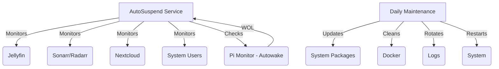

```markdown
# MediaServer AutoSuspend

[](https://opensource.org/licenses/MIT)
[](https://www.python.org/downloads/)
[](https://github.com/pirelike/mediaserver-autosuspend/issues)

MediaServer AutoSuspend is a smart power management solution designed for home media servers. It automatically monitors your media services, manages the server's power state (sleep/wake), and performs essential system maintenance, helping you save energy and keep your server healthy. It seamlessly integrates with [Autowake](https://github.com/pirelike/autowake) for convenient remote access via Wake-on-LAN.

## 🌟 Key Features - What It Does

*   **Intelligent Service Monitoring:** Keeps track of:
    *   **Jellyfin:** Detects active media playback sessions.
    *   **Sonarr/Radarr:** Monitors download queues for activity.
    *   **Nextcloud:** Checks for high CPU usage, indicating active file syncing or other tasks.
    *   **System Users:** Detects logged-in users.
    *   **Raspberry Pi (Autowake):** Monitors network traffic via a companion Raspberry Pi to determine if the server is needed.

*   **Automated Power Management:**
    *   **Smart Suspension:** Puts your server to sleep after a configurable period of inactivity, saving energy.
    *   **Scheduled Wake-Up:** Sets a wake-up timer to ensure your server is ready when needed.
    *   **Wake-on-LAN (WOL) Support:** Works with Autowake to allow you to wake up your server remotely with a WOL packet.

*   **Effortless System Maintenance:**
    *   **Automatic Updates:** Keeps your system up-to-date with the latest security patches.
    *   **Docker Cleanup (Optional):** Removes unused Docker images and containers to free up disk space.
    *   **Log Rotation:** Prevents log files from growing too large.
    *   **Scheduled Restarts:** Reboots your server periodically for optimal performance.

## 📋 Requirements - What You Need

### Server

*   **Operating System:** Ubuntu Server 20.04+ (recommended) or another Linux distribution with systemd.
*   **Python:** Version 3.8 or higher.
*   **Systemd:** The init system and service manager (common on most modern Linux distributions).
*   **Wake-on-LAN:** A network interface card (NIC) that supports Wake-on-LAN.
*   **`rtcwake` (Optional):** For setting wake-up timers using the real-time clock (RTC). Install it with `sudo apt install util-linux`

### Services (Optional, but recommended)

*   **Jellyfin:** For media streaming.
*   **Sonarr:** For TV show management.
*   **Radarr:** For movie management.
*   **Nextcloud:** For file syncing and sharing.
*   **Docker:** For running containerized services.

### Network

*   **Static IP Address:** Your media server should have a static IP address on your local network.
*   **Raspberry Pi with Autowake:** A Raspberry Pi running [Autowake](https://github.com/pirelike/autowake) to monitor network traffic and send WOL packets.
*   **Local Network:** Your server and Raspberry Pi must be on the same local network to allow WOL to function.

## 🚀 Quick Start Installation - Get Up and Running

These steps will guide you through a basic installation. For more advanced configuration options, see the [Advanced Configuration](#-advanced-configuration) section.

### 1. Prepare Your System

```bash
# Update your system's package list
sudo apt update

# Upgrade existing packages
sudo apt upgrade -y

# Install required packages
sudo apt install -y python3 python3-venv python3-pip git
```

### 2. Set Up Directories

```bash
# Create a directory for the project
sudo mkdir -p /home/mediaserver/scripts
sudo chown -R $USER:$USER /home/mediaserver/scripts

# Create a dedicated user (optional but recommended)
sudo adduser mediaserver
sudo usermod -aG sudo mediaserver  # Add the user to the sudo group (optional)
```

### 3. Install the Project

```bash
# Clone the repository
git clone https://github.com/pirelike/mediaserver-autosuspend.git
cd mediaserver-autosuspend

# Create a Python virtual environment
python3 -m venv /home/mediaserver/scripts/venv

# Activate the virtual environment
source /home/mediaserver/scripts/venv/bin/activate

# Install required Python packages
pip install -r requirements.txt

# Copy the scripts
sudo cp scripts/autosuspend.py /home/mediaserver/scripts/
sudo cp scripts/daily_maintenance.py /usr/local/bin/

# Create a basic set-wakeup.sh script (adjust for your system if needed)
echo '#!/bin/bash' | sudo tee /usr/local/bin/set-wakeup.sh
echo 'WAKEUP_TIME=$(date -d "tomorrow 06:00" +%s)' | sudo tee -a /usr/local/bin/set-wakeup.sh
echo 'rtcwake -m no -l -t "$WAKEUP_TIME"' | sudo tee -a /usr/local/bin/set-wakeup.sh
sudo chmod +x /usr/local/bin/set-wakeup.sh
```

### 4. Configure the Scripts

```bash
# Copy the example configuration files
sudo cp config/*.yaml.example /home/mediaserver/scripts/

# Rename the configuration files
cd /home/mediaserver/scripts/
sudo mv autosuspend_config.yaml.example autosuspend_config.yaml
sudo mv maintenance_config.yaml.example maintenance_config.yaml

# Edit the configuration files using nano (or your preferred editor)
sudo nano autosuspend_config.yaml
sudo nano maintenance_config.yaml
```

**Inside `autosuspend_config.yaml`:**

*   **`jellyfin`, `radarr`, `sonarr`, `nextcloud`:**
    *   Enter your API keys and URLs for each service.
    *   Set `enabled: yes` for services you want to monitor, `enabled: no` to disable.
    *   Adjust `timeout` values if needed.
*   **`raspberry_pi`:**
    *   Enter the URL of your Raspberry Pi running Autowake.
*   **`monitoring`:**
    *   Change `check_interval` (how often to check for activity) and `grace_period` (how long to wait before suspending) if desired.
*   **`logging`:**
    *   Adjust log file path and `max_lines` if necessary.

**Inside `maintenance_config.yaml`:**

*   Modify `grace_period`, `docker_prune`, `log_retention_days`, and `restart_delay` to your preferences.

### 5. Set Up Systemd Services

```bash
# Copy the systemd service files
sudo cp services/* /etc/systemd/system/

# Set appropriate permissions for the scripts
sudo chmod +x /home/mediaserver/scripts/autosuspend.py
sudo chmod +x /usr/local/bin/daily_maintenance.py

# Reload systemd to recognize the new service files
sudo systemctl daemon-reload

# Enable the services to start on boot
sudo systemctl enable autosuspend.service
sudo systemctl enable daily-maintenance.timer

# Start the services
sudo systemctl start autosuspend.service
sudo systemctl start daily-maintenance.timer
```

**You're done!** Your media server will now automatically suspend, wake up, and perform daily maintenance.

## 🔧 Advanced Configuration - Customize to Your Needs

### AutoSuspend Configuration (`autosuspend_config.yaml`)

```yaml
jellyfin:
  api_key: "your-jellyfin-api-key"  # Your Jellyfin API key
  url: "http://192.168.0.253:8096"    # Your Jellyfin server address
  timeout: 10                      # Timeout for Jellyfin API requests (seconds)
  enabled: yes                    # Enable or disable Jellyfin monitoring

radarr:
  api_key: "your-radarr-api-key"
  url: "http://localhost:7878"
  timeout: 5
  enabled: yes

sonarr:
  api_key: "your-sonarr-api-key"
  url: "http://localhost:8989"
  timeout: 5
  enabled: yes

nextcloud:
  url: "http://192.168.0.253:9000"
  token: "your-nextcloud-token"
  timeout: 5
  enabled: yes

raspberry_pi:
  url: "http://192.168.0.218:5005"  # Address of your Raspberry Pi running Autowake
  timeout: 5
  enabled: yes

system_users:
  enabled: no # Enable or disable monitoring for logged-in users

monitoring:
  check_interval: 30  # How often to check for activity (seconds)
  grace_period: 600   # Idle time before suspending (seconds)

logging:
  file: "/home/mediaserver/scripts/autosuspend.log"  # Log file path
  max_lines: 500                                    # Maximum log file size (lines)
```

### Maintenance Configuration (`maintenance_config.yaml`)

```yaml
logging:
  file: "/home/mediaserver/scripts/daily_maintenance.log"
  max_lines: 500

maintenance:
  grace_period: 60     # Time to wait after starting before running tasks (seconds)
  docker_prune: true   # Set to "true" to enable Docker cleanup, "false" to disable
  log_retention_days: 7  # Number of days to keep system logs
  restart_delay: 5      # Time to wait before restarting the system (seconds)
```

## 📊 System Architecture - How It Works



1. **Autowake (Raspberry Pi):** Monitors network traffic for activity related to your media server.
2. **AutoSuspend Service:**
    *   Continuously checks the status of Jellyfin, Sonarr/Radarr, Nextcloud, system users, and the Raspberry Pi (Autowake).
    *   If no activity is detected for the configured `grace_period`, it sets a wake-up timer and puts the server to sleep.
    *   Responds to Wake-on-LAN packets forwarded by Autowake.
3. **Daily Maintenance:**
    *   Runs once a day (scheduled by `daily-maintenance.timer`).
    *   Updates system packages.
    *   Cleans up Docker resources (if enabled).
    *   Rotates system logs.
    *   Restarts the server.

## 🔍 Monitoring and Logs - Keep an Eye on Things

### Service Status

```bash
# Check the status of the AutoSuspend service
systemctl status autosuspend.service

# Check the status of the daily maintenance timer
systemctl list-timers daily-maintenance.timer
```

### Viewing Logs

```bash
# View the AutoSuspend logs
journalctl -u autosuspend.service -f

# View the daily maintenance logs
tail -f /home/mediaserver/scripts/daily_maintenance.log
```

## 🛠️ Troubleshooting - Fix Common Issues

### Diagnostics

```bash
# Check the overall system state
systemctl status

# View detailed AutoSuspend logs (last 100 lines)
journalctl -u autosuspend.service -n 100 --no-pager

# Test Wake-on-LAN functionality (replace with your server's MAC address)
wakeonlan -i 192.168.1.255 XX:XX:XX:XX:XX:XX
```

### Common Problems

1. **Service Won't Start:**
    *   **Check Python dependencies:** Make sure all required packages are installed in your virtual environment.
    *   **Verify configuration:** Double-check your `autosuspend_config.yaml` and `maintenance_config.yaml` for errors.
    *   **Permissions:** Ensure the scripts have execute permissions (`chmod +x`) and the `mediaserver` user has the necessary permissions.
    *   **Logs:** Examine the logs for error messages.

2. **Server Won't Suspend:**
    *   **Active services:** Check if any of the monitored services are still active.
    *   **Grace period:** Ensure the `grace_period` is long enough to account for short bursts of activity.
    *   **Logs:** Look for messages in the AutoSuspend log indicating why the server is not suspending.
    *   **Raspberry Pi (Autowake):** If using Autowake make sure the configuration is correct.

3. **Wake-Up Issues:**
    *   **BIOS settings:** Verify that Wake-on-LAN is enabled in your server's BIOS settings.
    *   **Network configuration:** Check that your server has a static IP address and your network supports WOL.
    *   **Test WOL packets:** Use the `wakeonlan` command (or a similar tool) to send a test WOL packet to your server's MAC address.
    *   **`set-wakeup.sh`:** Make sure that `set-wakeup.sh` is correctly setting the RTC wake-up time (if applicable).

## 🤝 Contributing - Help Make It Better

We welcome contributions to improve MediaServer AutoSuspend! Please see our [Contributing Guide](https://github.com/pirelike/mediaserver-autosuspend/blob/main/CONTRIBUTING.md) for details on how to:

*   Report bugs or suggest features.
*   Submit pull requests.
*   Follow our code style guidelines.
*   Set up your development environment.

## 📄 License

This project is licensed under the MIT License - see the [LICENSE](https://github.com/pirelike/mediaserver-autosuspend/blob/main/LICENSE) file for details.

## 🔒 Security - Keeping Things Safe

*   **Local Storage:** API keys and other sensitive information are stored locally on your server.
*   **Minimal Permissions:** The `autosuspend.py` script runs as a dedicated user (`mediaserver`) with limited permissions.
*   **Logging:** Comprehensive logging helps you monitor activity and troubleshoot issues.
*   **Updates:** The daily maintenance script keeps your system up-to-date with security patches.

## 📚 Documentation - Learn More

*   [Project Wiki](https://github.com/pirelike/mediaserver-autosuspend/wiki) - In-depth information and guides.
*   [API Reference](https://github.com/pirelike/mediaserver-autosuspend/wiki/API-Reference) - Details about the APIs used.
*   [Configuration Guide](https://github.com/pirelike/mediaserver-autosuspend/wiki/Configuration) - A comprehensive guide to all configuration options.
*   [Troubleshooting](https://github.com/pirelike/mediaserver-autosuspend/wiki/Troubleshooting) - Solutions to common problems.

## 🔗 Related Projects

*   [Autowake](https://github.com/pirelike/autowake) - Companion Wake-on-LAN monitor (highly recommended).
*   [Set-Wakeup](https://github.com/pirelike/set-wakeup) - A utility for setting RTC wake-up times.
```
