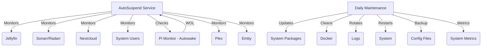

# Under Construction

# MediaServer AutoSuspend

[](https://opensource.org/licenses/MIT)
[](https://www.python.org/downloads/)
[](https://github.com/pirelike/mediaserver-autosuspend/issues)
[](https://github.com/psf/black)

MediaServer AutoSuspend is a comprehensive and intelligent power management solution designed for home media servers. It goes beyond simply putting your server to sleep; it actively monitors your media services, intelligently manages the server's power state (sleep/wake), performs essential system maintenance, and provides advanced features for a robust and efficient setup. By automating these tasks, MediaServer AutoSuspend helps you save energy, keep your server healthy, and enjoy a seamless media experience. It's designed to integrate seamlessly with [Autowake](https://github.com/pirelike/autowake) for convenient remote access via Wake-on-LAN.

## 🌟 Key Features - What It Does

### Intelligent Service Monitoring

MediaServer AutoSuspend keeps a watchful eye on your essential media services, accurately detecting their activity status:

*   **Jellyfin:** Detects active media playback sessions by checking for "NowPlayingItem" in active sessions.
*   **Sonarr/Radarr:** Monitors download queues, identifying active downloads based on the number of records in the queue.
*   **Nextcloud:** Checks for high CPU usage, a reliable indicator of active file syncing or other resource-intensive tasks.
*   **System Users:** Detects logged-in users using the `who` command, differentiating between active and idle users.
*   **Raspberry Pi (Autowake):** Monitors network traffic via a companion Raspberry Pi running [Autowake](https://github.com/pirelike/autowake), determining if the server is needed based on network activity patterns.
*   **Plex:** Detects active media playback sessions by checking the number of sessions and their states.
*   **Emby:** Detects active media playback sessions by checking the "NowPlayingItem" and "UserName" in active sessions.

### Automated Power Management

MediaServer AutoSuspend intelligently manages your server's power state to maximize energy savings without compromising accessibility:

*   **Smart Suspension:** Puts your server to sleep after a configurable period of inactivity, significantly reducing power consumption.
*   **Scheduled Wake-Up:** Sets a wake-up timer to ensure your server is ready for scheduled tasks or anticipated usage periods.
*   **Wake-on-LAN (WOL) Support:** Integrates with Autowake, allowing you to wake up your server remotely with a WOL packet.
*   **Grace Period with Fine-Grained Control:** Provides a configurable grace period during which the system will not suspend, even if idle. You can also adjust the frequency of checks during this grace period.
*   **Last-Minute Activity Checks:** Performs final checks just before suspension to prevent unnecessary sleep if activity is detected at the last moment.

### Effortless System Maintenance

The `daily_maintenance.py` script takes care of essential system maintenance tasks, ensuring your server remains in top shape:

*   **Automatic Updates:** Keeps your system up-to-date with the latest security patches and software updates using `apt`.
*   **Docker Cleanup (Optional):** Removes unused Docker images, containers, and volumes to free up disk space.
*   **Log Rotation:** Employs an efficient line-based log rotation mechanism to prevent log files from growing too large.
*   **Scheduled Restarts:** Reboots your server periodically for optimal performance and stability.
*   **Filesystem Sync:** Ensures data integrity by syncing the filesystem before critical operations.

### Advanced Features

MediaServer AutoSuspend is packed with advanced features that provide enhanced control, reliability, and security:

*   **Configuration Validation:**  Thoroughly validates your configuration file against a predefined schema using `jsonschema`, preventing unexpected errors due to misconfigurations.
*   **API Request Caching:** Reduces redundant API calls by caching responses using a custom `APICache` class with configurable Time-To-Live (TTL).
*   **Comprehensive Health Checks:**  Performs in-depth health checks on various components, including:
    *   **System Health:** Disk space, system load, memory usage, critical services, filesystem health, and system temperature.
    *   **Task Health:** Status of maintenance tasks (e.g., last successful run).
    *   **Resource Health:** Current resource usage vs. configured limits.
    *   **Network Health:** Status of network interfaces (up/down, IP address).
    *   **Database Health:** Connection and basic query test for the configured database.
*   **Graceful Shutdown:** Handles shutdown signals (SIGINT, SIGTERM) to ensure a clean exit, releasing resources and performing cleanup tasks.
*   **Activity History:** Tracks the recent activity status of each service using the `ActivityHistory` class, providing insights into usage patterns.
*   **Configurable Timeouts and Retries:** Fine-tune timeouts and retry attempts for network requests, enhancing robustness against network issues.
*   **Secure System Commands:** Uses predefined paths for system commands (e.g., `who`, `systemctl`, `sync`) to enhance security.
*   **Single Instance Check:** Prevents multiple instances of the script from running simultaneously, avoiding conflicts and ensuring data consistency.
*   **Pre and Post Maintenance Hooks:**  Allows you to define custom actions to be executed before and after maintenance tasks.
*   **System State Verification:** Verifies that the system is in a good state before performing maintenance tasks.
*   **Detailed System Metrics:** Collects comprehensive system metrics (disk usage, memory usage, load average, etc.) before and after maintenance, allowing you to track the impact of maintenance operations.
*   **Extended Metrics:** Gathers additional metrics like process-specific resource usage, network activity, and disk I/O statistics.
*   **Resource Management:** Implements a `ResourceManager` to allocate and release resources for tasks, preventing resource overutilization.
*   **Backup Management:**  Includes a `BackupManager` to handle backups of important files (e.g., configuration files) before maintenance.
*   **Metrics Export:** The `MetricsExporter` allows you to export collected metrics to a file for later analysis.
*   **Task Scheduler with Dependencies and Prioritization:**  The `TaskScheduler` manages tasks, their dependencies, and execution order based on priority.
*   **Task Retry Logic with Circuit Breaker:** Implements robust retry logic with a `CircuitBreaker` to handle temporary failures and prevent cascading failures.
*   **Task Progress Tracking:**  Provides real-time progress updates on the status of maintenance tasks.

## 📋 Requirements - What You Need

### Server

*   **Operating System:** Ubuntu Server 20.04+ (recommended) or another Linux distribution with systemd.
*   **Python:** Version 3.8 or higher.
*   **Systemd:** The init system and service manager (common on most modern Linux distributions).
*   **Wake-on-LAN:** A network interface card (NIC) that supports Wake-on-LAN.
*   **`rtcwake` (Optional):** For setting wake-up timers using the real-time clock (RTC). Install it with `sudo apt install util-linux`

### Services (Optional, but recommended)

*   **Jellyfin:** For media streaming.
*   **Sonarr:** For TV show management.
*   **Radarr:** For movie management.
*   **Nextcloud:** For file syncing and sharing.
*   **Plex:** For media streaming.
*   **Emby:** For media streaming.
*   **Docker:** For running containerized services.

### Network

*   **Static IP Address:** Your media server should have a static IP address on your local network.
*   **Raspberry Pi with Autowake:** A Raspberry Pi running [Autowake](https://github.com/pirelike/autowake) to monitor network traffic and send WOL packets.
*   **Local Network:** Your server and Raspberry Pi must be on the same local network to allow WOL to function.

## 🚀 Quick Start Installation - Get Up and Running

These steps will guide you through a basic installation. For more advanced configuration options, see the [Advanced Configuration](#-advanced-configuration) section.

### 1. Prepare Your System

```bash
# Update your system's package list
sudo apt update

# Upgrade existing packages
sudo apt upgrade -y

# Install required packages
sudo apt install -y python3 python3-venv python3-pip git
```

### 2. Set Up Directories

```bash
# Create a directory for the project
sudo mkdir -p /home/mediaserver/scripts
sudo chown -R $USER:$USER /home/mediaserver/scripts

# Create a dedicated user (optional but recommended)
sudo adduser mediaserver
sudo usermod -aG sudo mediaserver  # Add the user to the sudo group (optional)
```

### 3. Install the Project

```bash
# Clone the repository
git clone https://github.com/pirelike/mediaserver-autosuspend.git
cd mediaserver-autosuspend

# Create a Python virtual environment
python3 -m venv /home/mediaserver/scripts/venv

# Activate the virtual environment
source /home/mediaserver/scripts/venv/bin/activate

# Install required Python packages
pip install -r requirements.txt

# Copy the scripts
sudo cp scripts/autosuspend.py /home/mediaserver/scripts/
sudo cp scripts/daily_maintenance.py /usr/local/bin/

# Create a basic set-wakeup.sh script (adjust for your system if needed)
echo '#!/bin/bash' | sudo tee /usr/local/bin/set-wakeup.sh
echo 'WAKEUP_TIME=$(date -d "tomorrow 06:00" +%s)' | sudo tee -a /usr/local/bin/set-wakeup.sh
echo 'rtcwake -m no -l -t "$WAKEUP_TIME"' | sudo tee -a /usr/local/bin/set-wakeup.sh
sudo chmod +x /usr/local/bin/set-wakeup.sh
```

### 4. Configure the Scripts

```bash
# Copy the example configuration files
sudo cp config/*.yaml.example /home/mediaserver/scripts/

# Rename the configuration files
cd /home/mediaserver/scripts/
sudo mv autosuspend_config.yaml.example autosuspend_config.yaml
sudo mv maintenance_config.yaml.example maintenance_config.yaml

# Edit the configuration files using nano (or your preferred editor)
sudo nano autosuspend_config.yaml
sudo nano maintenance_config.yaml
```

**Inside `autosuspend_config.yaml`:**

*   **`jellyfin`, `radarr`, `sonarr`, `nextcloud`, `plex`, `emby`:**
    *   Enter your API keys and URLs for each service. See the [API Key Guide](#-guide-to-obtaining-api-keys-for-mediaserver-autosuspend)
    *   Set `enabled: true` for services you want to monitor, `enabled: false` to disable.
    *   Adjust `timeout` and `ssl_verify` values if needed.
*   **`raspberry_pi`:**
    *   Enter the URL of your Raspberry Pi running Autowake.
    *   Adjust the `timeout` value if necessary.
*   **`system_users`:**
    *   Set `enabled: true` to monitor for logged-in users, `enabled: false` to disable.
*   **`monitoring`:**
    *   Change `check_interval` (how often to check for activity) and `grace_period` (how long to wait before suspending) if desired.
    *   Adjust `max_retries` and `retry_delay` for API call retries.
    *   Modify `grace_period_check_interval` to control how often to check during the grace period.
*   **`logging`:**
    *   Adjust log file path and `max_lines` if necessary.
*   **`suspend`:**
    *   Configure `pre_suspend_commands` and `post_resume_commands` to run custom commands before suspend and after resume.
    *   Set `minimum_uptime` to prevent suspension if the system hasn't been up for a certain duration.
    *   Enable `check_battery` if running on a laptop or system with a battery.

**Inside `maintenance_config.yaml`:**

*   Modify `grace_period`, `docker_prune`, `log_retention_days`, and `restart_delay` to your preferences.
*   Adjust `resource_limits` (CPU and memory) to prevent the script from overloading your system.
*   Configure `network` settings to monitor specific network interfaces and bandwidth usage.
*   Enable `backups` and set the `directory` for backup files.
*   Enable `metrics` and configure the `export_path` for metrics export.
*   Provide `database` connection details if you want to monitor database health.

### 5. Set Up Systemd Services

```bash
# Copy the systemd service files
sudo cp services/* /etc/systemd/system/

# Set appropriate permissions for the scripts
sudo chmod +x /home/mediaserver/scripts/autosuspend.py
sudo chmod +x /usr/local/bin/daily_maintenance.py

# Reload systemd to recognize the new service files
sudo systemctl daemon-reload

# Enable the services to start on boot
sudo systemctl enable autosuspend.service
sudo systemctl enable daily-maintenance.timer

# Start the services
sudo systemctl start autosuspend.service
sudo systemctl start daily-maintenance.timer
```

**You're done!** Your media server will now automatically suspend, wake up, and perform daily maintenance.

## 🔧 Advanced Configuration - Customize to Your Needs

### AutoSuspend Configuration (`autosuspend_config.yaml`)

```yaml
# --- Service Monitoring ---
jellyfin:
  api_key: "your-jellyfin-api-key"  # Your Jellyfin API key
  url: "http://192.168.0.253:8096"    # Your Jellyfin server address
  timeout: 10                      # Timeout for Jellyfin API requests (seconds)
  enabled: true                    # Enable or disable Jellyfin monitoring
  ssl_verify: true                 # Enable or disable SSL certificate verification

radarr:
  api_key: "your-radarr-api-key"
  url: "http://localhost:7878"
  timeout: 5
  enabled: true
  ssl_verify: true

sonarr:
  api_key: "your-sonarr-api-key"
  url: "http://localhost:8989"
  timeout: 5
  enabled: true
  ssl_verify: true

nextcloud:
  url: "http://192.168.0.253:9000"
  token: "your-nextcloud-token"
  timeout: 5
  enabled: true
  ssl_verify: true

raspberry_pi:
  url: "http://192.168.0.218:5005"  # Address of your Raspberry Pi running Autowake
  timeout: 5
  enabled: true
  ssl_verify: false  # Disable SSL verification if your Pi doesn't have a valid certificate

system_users:
  enabled: false # Enable or disable monitoring for logged-in users
  excluded_users: [] # List of users to exclude from monitoring (optional)

plex:
  url: "http://192.168.0.253:32400" # Your Plex server address (with port)
  token: "your-plex-token" # Your Plex authentication token, refer to "Obtaining a Plex Token"
  timeout: 5 # Timeout for Plex API requests (seconds)
  enabled: true # Enable or disable Plex monitoring
  ssl_verify: true

emby:
  url: "http://192.168.0.253:8096" # Your Emby server address
  api_key: "your-emby-api-key" # Your Emby API key
  timeout: 5 # Timeout for Emby API requests (seconds)
  enabled: true # Enable or disable Emby monitoring
  ssl_verify: true

# --- Monitoring Behavior ---
monitoring:
  check_interval: 30             # How often to check for activity (seconds)
  grace_period: 600              # Idle time before suspending (seconds)
  grace_period_check_interval: 60 # Check interval during the grace period (seconds)
  max_retries: 3                 # Maximum retries for API requests
  retry_delay: 5                # Delay between retries (seconds)
  startup_delay: 60              # Delay on script startup (seconds)

# --- Logging ---
logging:
  file: "/home/mediaserver/scripts/autosuspend.log"  # Log file path
  max_lines: 500                                    # Maximum log file size (lines)
  level: "INFO"                                     # Log level (DEBUG, INFO, WARNING, ERROR, CRITICAL)

# --- Global Settings ---
ssl:
  verify: true  # Global SSL verification setting
  cert_path: null  # Optional: Path to custom SSL certificate

network:
  timeout: 10  # Global default timeout
  max_retries: 3  # Global default retry count

# --- Suspend Settings ---
suspend:
  pre_suspend_commands: []  # Commands to run before suspending
  post_resume_commands: []  # Commands to run after resuming
  minimum_uptime: 300  # Minimum uptime before allowing suspend (seconds)
  check_battery: false  # Set to true if running on a system with a battery
```

# Guide to Obtaining API Keys for MediaServer AutoSuspend

This guide will walk you through the process of obtaining API keys for each service supported by MediaServer AutoSuspend.

### Jellyfin API Key
1. Log in to your Jellyfin web interface as an administrator
2. Go to Dashboard (Admin panel)
3. Navigate to Advanced → API Keys
4. Click "New API Key"
5. Enter a name for the key (e.g., "AutoSuspend")
6. Click "OK" to generate the key
7. Copy the generated API key

### Sonarr API Key
1. Log in to your Sonarr web interface
2. Go to Settings → General
3. Look for the "API Key" section
4. The API key will be displayed there (or click "Show" if it's hidden)
5. Copy the API key

### Radarr API Key
1. Log in to your Radarr web interface
2. Go to Settings → General
3. Look for the "API Key" section
4. The API key will be displayed there (or click "Show" if it's hidden)
5. Copy the API key

### Nextcloud Token
1. Log in to your Nextcloud web interface
2. Click on your profile picture in the top right
3. Go to Settings → Security
4. Scroll down to "App passwords" or "Security tokens"
5. Enter a name for the token (e.g., "AutoSuspend")
6. Click "Create new app password"
7. Copy the generated token

## Plex Token
Method 1 (Using Web Interface):
1. Log in to Plex Web App (app.plex.tv)
2. Play any media file
3. Right-click on the playing content
4. Select "Get Info" or "View XML"
5. In the URL that opens, look for "X-Plex-Token=" parameter
6. Copy the string after "X-Plex-Token="

Method 2 (Using Account Page):
1. Log in to plex.tv
2. Go to Settings → Account
3. Under "Account Settings," find "Authorized Devices"
4. Click on the device name for your server
5. The token will be visible in the URL (after "token=")

### Emby API Key
1. Log in to your Emby web interface as an administrator
2. Go to Dashboard
3. Navigate to Advanced → API Keys
4. Click "New API Key"
5. Enter a name for the key (e.g., "AutoSuspend")
6. Select appropriate access levels (full access recommended for AutoSuspend)
7. Click "OK" to generate the key
8. Copy the generated API key

### Security Considerations
- Keep your API keys secure and never share them
- Use separate API keys for different applications when possible
- Regularly rotate API keys if the service supports it
- Store API keys in the config file with appropriate file permissions (600 or 640)
- Back up your API keys securely
- If you suspect an API key has been compromised, regenerate it immediately

### Troubleshooting
If you get "Unauthorized" errors:
1. Verify you've copied the entire API key
2. Check if the API key has the necessary permissions
3. Ensure the service is running and accessible
4. Verify the URL in your config points to the correct server address
5. Check if the service requires additional authentication headers

### Maintenance Configuration (`maintenance_config.yaml`)

```yaml
# --- Logging ---
logging:
  file: "/home/mediaserver/scripts/daily_maintenance.log"  # Path to the log file
  max_lines: 500   # Maximum number of lines to keep in the log file
  level: "INFO"   # Log level (DEBUG, INFO, WARNING, ERROR, CRITICAL)

# --- Maintenance Tasks ---
maintenance:
  grace_period: 60        # Wait time after script start before running tasks (seconds)
  docker_prune: true      # Whether to clean Docker (yes/no, true/false, 1/0)
  log_retention_days: 7   # System log retention (days)
  restart_delay: 5        # Seconds to wait before restart

# --- Resource Limits ---
resource_limits:
  cpu_percent: 80         # Maximum CPU usage percentage
  memory_limit_mb: 1024   # Maximum memory usage in MB

# --- Network Settings ---
network:
  allowed_interfaces:     # List of network interfaces to monitor
    - eth0
    - wlan0
  max_bandwidth_mbps: 100 # Maximum bandwidth in Mbps

# --- Backup Settings ---
backups:
  enabled: true          # Enable backup functionality
  directory: "/home/mediaserver/backups"  # Directory to store backups

# --- Metrics Export ---
metrics:
  export_enabled: true   # Enable metrics export
  export_path: "/home/mediaserver/metrics/maintenance_metrics.jsonl"  # Path for metrics export

# --- Database Settings ---
database:
  host: "localhost"      # Database host
  port: 5432            # Database port
  user: "maintenance"   # Database user
  password: "your-secure-password"  # Database password
  name: "maintenance_db"  # Database name
```

## 📊 System Architecture - How It Works



1. **Autowake (Raspberry Pi):** Monitors network traffic for activity related to your media server, sending WOL packets when activity is detected.
2. **AutoSuspend Service:**
    *   Continuously checks the status of Jellyfin, Sonarr/Radarr, Nextcloud, system users, the Raspberry Pi (Autowake), Plex and Emby.
    *   Caches API responses to reduce redundant calls using an efficient caching mechanism with configurable TTL.
    *   Implements robust retry logic with a configurable circuit breaker to handle temporary service unavailability.
    *   If no activity is detected for the configured `grace_period`, it sets a wake-up timer and puts the server to sleep.
    *   Responds to Wake-on-LAN packets forwarded by Autowake.
    *   Reloads the config when receiving a SIGHUP signal.
    *   Performs a final activity check before suspend to avoid unnecessary suspensions.
    *   Logs a detailed summary of each service's activity status, including timestamps and relevant details.
    *   Enforces resource limits to prevent excessive CPU and memory usage.
    *   Manages task dependencies and execution order using a task scheduler.
    *   Tracks task progress and provides real-time updates.
    *   Handles pre and post-maintenance hooks for custom actions.
    *   Verifies system state before performing critical operations.
3. **Daily Maintenance:**
    *   Runs once a day (scheduled by `daily_maintenance.timer`).
    *   Updates system packages using `apt`.
    *   Cleans up Docker resources (if enabled) using `docker system prune`.
    *   Rotates system logs using `journalctl`.
    *   Restarts the system after a configurable delay.
    *   Backs up important files (e.g., configuration files) using the `BackupManager`.
    *   Collects and exports system metrics using the `MetricsExporter`.
    *   Performs health checks on various system components and services.

## 🔍 Monitoring and Logs - Keep an Eye on Things

### Service Status

```bash
# Check the status of the AutoSuspend service
systemctl status autosuspend.service

# Check the status of the daily maintenance timer
systemctl list-timers daily-maintenance.timer
```

### Viewing Logs

```bash
# View the AutoSuspend logs
journalctl -u autosuspend.service -f

# View the daily maintenance logs
tail -f /home/mediaserver/scripts/daily_maintenance.log

# View logs with line numbers and timestamps
journalctl -u autosuspend.service -n 100 --no-pager -o short-iso
```

## 🛠️ Troubleshooting - Fix Common Issues

### Diagnostics

```bash
# Check the overall system state
systemctl status

# View detailed AutoSuspend logs (last 100 lines)
journalctl -u autosuspend.service -n 100 --no-pager

# Test Wake-on-LAN functionality (replace with your server's MAC address)
wakeonlan -i 192.168.1.255 XX:XX:XX:XX:XX:XX
```

### Common Problems

1. **Service Won't Start:**
    *   **Check Python dependencies:** Make sure all required packages are installed in your virtual environment. Use `pip install -r requirements.txt`.
    *   **Verify configuration:** Double-check your `autosuspend_config.yaml` and `maintenance_config.yaml` for errors. Use a YAML validator to ensure the syntax is correct.
    *   **Permissions:** Ensure the scripts have execute permissions (`chmod +x`) and the `mediaserver` user has the necessary permissions.
    *   **Logs:** Examine the logs for error messages. Use `journalctl -u autosuspend.service` or `tail -f /home/mediaserver/scripts/autosuspend.log`
    *   **Configuration Validation:** The application validates the configuration file on startup and will output errors if there are any issues. Look for validation error messages in the logs.

2. **Server Won't Suspend:**
    *   **Active services:** Check if any of the monitored services are still active. Use the service status commands or check the logs.
    *   **Grace period:** Ensure the `grace_period` is long enough to account for short bursts of activity.
    *   **Logs:** Look for messages in the AutoSuspend log indicating why the server is not suspending.
    *   **Raspberry Pi (Autowake):** If using Autowake make sure the configuration is correct and the Pi is reachable.
    *   **API Caching:** If a service check returns a cached 'active' result, it might prevent suspension. Check the cache TTL and consider clearing the cache if needed.
    * **Minimum Uptime:** Check if the `minimum_uptime` setting is preventing suspension.

3. **Wake-Up Issues:**
    *   **BIOS settings:** Verify that Wake-on-LAN is enabled in your server's BIOS settings.
    *   **Network configuration:** Check that your server has a static IP address and your network supports WOL.
    *   **Test WOL packets:** Use the `wakeonlan` command (or a similar tool) to send a test WOL packet to your server's MAC address.
    *   **`set-wakeup.sh`:** Make sure that `set-wakeup.sh` is correctly setting the RTC wake-up time (if applicable). Verify the script's contents and permissions.

### Specific Service Issues

*   **Jellyfin/Sonarr/Radarr/Plex/Emby:**
    *   **`Unexpected response format`:** This usually indicates an issue with the API response. Check the service's URL, API key, and make sure the service is running correctly. Verify that the API hasn't changed.
    *   **`HTTP error (401 Unauthorized)`:** This means your API key or token is invalid or expired. Double-check the API key in your config file.
    *   **`Connection error`:** Ensure that the service is running and accessible from your server. Check firewall rules and network connectivity.
*   **Nextcloud:**
    *   **`Failed to parse response`:**  Indicates an issue with the response from Nextcloud. Verify the URL and token. Check if the Nextcloud API has changed.
*   **Raspberry Pi (Autowake):**
    *   **`Failed to parse response`:** Check the Autowake configuration and make sure it's returning the expected JSON format. Verify that the Autowake service is running and accessible.

### Debugging Tips
*   **Increase Log Level:** Set the `level` to `DEBUG` in your configuration file for more verbose logging.
*   **Test Individual Components:**  Try running parts of the script manually (e.g., individual service checks) to isolate the problem.
*   **Use Print Statements:** Add temporary `print()` statements to your code to track variable values and execution flow.
*   **Check for Typos:** Carefully review your configuration files and scripts for typos, especially in URLs, API keys, and file paths.
*   **Restart Services:** If you make configuration changes, restart the `autosuspend` and `daily-maintenance` services:
    ```bash
    sudo systemctl restart autosuspend.service
    sudo systemctl restart daily-maintenance.service
    ```

## 🤝 Contributing - Help Make It Better

We welcome contributions to improve MediaServer AutoSuspend! Please see our [Contributing Guide](https://github.com/pirelike/mediaserver-autosuspend/blob/main/CONTRIBUTING.md) for details on how to:

*   Report bugs or suggest features.
*   Submit pull requests.
*   Follow our code style guidelines.
*   Set up your development environment.

## 🔗 Related Projects

*   [Autowake](https://github.com/pirelike/autowake) - Companion Wake-on-LAN monitor (highly recommended).
*   [Set-Wakeup](https://github.com/pirelike/set-wakeup) - A utility for setting RTC wake-up times.

## 🔮 Future Enhancements

*   **Web Interface:** A web-based dashboard for monitoring and controlling the service, providing a user-friendly way to view status, logs, and configure settings.
*   **Asynchronous Operations:** Improve performance by using asynchronous operations for network requests, allowing concurrent service checks and reducing overall execution time.
*   **Dynamic Wake-up Times:**  Instead of a fixed time, use a more dynamic approach to setting the wake-up timer based on usage patterns or external triggers (e.g., calendar events, sunrise/sunset times).
* **Service Auto-Detection:** Implement a mechanism to automatically detect and configure installed services, simplifying the setup process for new users.
* **Alerting:** Integrate with notification services (e.g., Pushover, Telegram, etc.) to send alerts when errors occur or when the system is suspended/resumed, providing proactive monitoring and issue notification.
* **Containerization:** Package the application in a Docker container for easier deployment and portability.
* **Improved Error Handling:** Implement more specific exception handling to provide more informative error messages and better diagnostics.

## 🙏 Acknowledgments

*   Thanks to all the contributors who have helped improve this project.
*   The developers of the services that this project integrates with.

## 📄 License

This project is licensed under the MIT License - see the [LICENSE](https://github.com/pirelike/mediaserver-autosuspend/blob/main/LICENSE) file for details.
