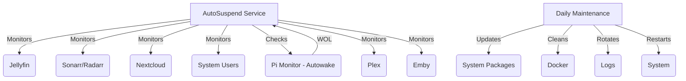

# MediaServer AutoSuspend

[](https://opensource.org/licenses/MIT)
[](https://www.python.org/downloads/)
[](https://github.com/pirelike/mediaserver-autosuspend/issues)
[](https://github.com/psf/black)

MediaServer AutoSuspend is a smart power management solution designed for home media servers. It automatically monitors your media services, manages the server's power state (sleep/wake), and performs essential system maintenance, helping you save energy and keep your server healthy. It seamlessly integrates with [Autowake](https://github.com/pirelike/autowake) for convenient remote access via Wake-on-LAN.

## 🌟 Key Features - What It Does

*   **Intelligent Service Monitoring:** Keeps track of:
    *   **Jellyfin:** Detects active media playback sessions.
    *   **Sonarr/Radarr:** Monitors download queues for activity.
    *   **Nextcloud:** Checks for high CPU usage, indicating active file syncing or other tasks.
    *   **System Users:** Detects logged-in users.
    *   **Raspberry Pi (Autowake):** Monitors network traffic via a companion Raspberry Pi to determine if the server is needed.
    *   **Plex:** Detects active media playback sessions.
    *   **Emby:** Detects active media playback sessions.

*   **Automated Power Management:**
    *   **Smart Suspension:** Puts your server to sleep after a configurable period of inactivity, saving energy.
    *   **Scheduled Wake-Up:** Sets a wake-up timer to ensure your server is ready when needed.
    *   **Wake-on-LAN (WOL) Support:** Works with Autowake to allow you to wake up your server remotely with a WOL packet.

*   **Effortless System Maintenance:**
    *   **Automatic Updates:** Keeps your system up-to-date with the latest security patches.
    *   **Docker Cleanup (Optional):** Removes unused Docker images and containers to free up disk space.
    *   **Log Rotation:** Prevents log files from growing too large using efficient methods.
    *   **Scheduled Restarts:** Reboots your server periodically for optimal performance.

*   **Advanced Features:**
    *   **Configuration Validation:** Ensures your configuration file is valid to prevent unexpected errors.
    *   **API Request Caching:** Reduces redundant API calls by caching responses.
    *   **Health Checks:** Verifies that your services are reachable and responsive.
    *   **Graceful Shutdown:** Handles shutdown signals to ensure a clean exit.
    *   **Activity History:** Tracks the recent activity status of each service.
    *   **Configurable Timeouts and Retries:** Fine-tune timeouts and retry attempts for network requests.
    *   **Secure System Commands:** Uses predefined paths for system commands to enhance security.

## 📋 Requirements - What You Need

### Server

*   **Operating System:** Ubuntu Server 20.04+ (recommended) or another Linux distribution with systemd.
*   **Python:** Version 3.8 or higher.
*   **Systemd:** The init system and service manager (common on most modern Linux distributions).
*   **Wake-on-LAN:** A network interface card (NIC) that supports Wake-on-LAN.
*   **`rtcwake` (Optional):** For setting wake-up timers using the real-time clock (RTC). Install it with `sudo apt install util-linux`

### Services (Optional, but recommended)

*   **Jellyfin:** For media streaming.
*   **Sonarr:** For TV show management.
*   **Radarr:** For movie management.
*   **Nextcloud:** For file syncing and sharing.
*   **Plex:** For media streaming.
*   **Emby:** For media streaming.
*   **Docker:** For running containerized services.

### Network

*   **Static IP Address:** Your media server should have a static IP address on your local network.
*   **Raspberry Pi with Autowake:** A Raspberry Pi running [Autowake](https://github.com/pirelike/autowake) to monitor network traffic and send WOL packets.
*   **Local Network:** Your server and Raspberry Pi must be on the same local network to allow WOL to function.

## 🚀 Quick Start Installation - Get Up and Running

These steps will guide you through a basic installation. For more advanced configuration options, see the [Advanced Configuration](#-advanced-configuration) section.

### 1. Prepare Your System

```bash
# Update your system's package list
sudo apt update

# Upgrade existing packages
sudo apt upgrade -y

# Install required packages
sudo apt install -y python3 python3-venv python3-pip git
```

### 2. Set Up Directories

```bash
# Create a directory for the project
sudo mkdir -p /home/mediaserver/scripts
sudo chown -R $USER:$USER /home/mediaserver/scripts

# Create a dedicated user (optional but recommended)
sudo adduser mediaserver
sudo usermod -aG sudo mediaserver  # Add the user to the sudo group (optional)
```

### 3. Install the Project

```bash
# Clone the repository
git clone https://github.com/pirelike/mediaserver-autosuspend.git
cd mediaserver-autosuspend

# Create a Python virtual environment
python3 -m venv /home/mediaserver/scripts/venv

# Activate the virtual environment
source /home/mediaserver/scripts/venv/bin/activate

# Install required Python packages
pip install -r requirements.txt

# Copy the scripts
sudo cp scripts/autosuspend.py /home/mediaserver/scripts/
sudo cp scripts/daily_maintenance.py /usr/local/bin/

# Create a basic set-wakeup.sh script (adjust for your system if needed)
echo '#!/bin/bash' | sudo tee /usr/local/bin/set-wakeup.sh
echo 'WAKEUP_TIME=$(date -d "tomorrow 06:00" +%s)' | sudo tee -a /usr/local/bin/set-wakeup.sh
echo 'rtcwake -m no -l -t "$WAKEUP_TIME"' | sudo tee -a /usr/local/bin/set-wakeup.sh
sudo chmod +x /usr/local/bin/set-wakeup.sh
```

### 4. Configure the Scripts

```bash
# Copy the example configuration files
sudo cp config/*.yaml.example /home/mediaserver/scripts/

# Rename the configuration files
cd /home/mediaserver/scripts/
sudo mv autosuspend_config.yaml.example autosuspend_config.yaml
sudo mv maintenance_config.yaml.example maintenance_config.yaml

# Edit the configuration files using nano (or your preferred editor)
sudo nano autosuspend_config.yaml
sudo nano maintenance_config.yaml
```

**Inside `autosuspend_config.yaml`:**

*   **`jellyfin`, `radarr`, `sonarr`, `nextcloud`, `plex`, `emby`:**
    *   Enter your API keys and URLs for each service.
    *   Set `enabled: yes` for services you want to monitor, `enabled: no` to disable.
    *   Adjust `timeout` values if needed.
*   **`raspberry_pi`:**
    *   Enter the URL of your Raspberry Pi running Autowake.
*   **`monitoring`:**
    *   Change `check_interval` (how often to check for activity) and `grace_period` (how long to wait before suspending) if desired.
    *   Adjust `max_retries` and `retry_delay` for API call retries.
    *   Modify `grace_period_check_interval` to control how often to check during the grace period.
*   **`logging`:**
    *   Adjust log file path and `max_lines` if necessary.

**Inside `maintenance_config.yaml`:**

*   Modify `grace_period`, `docker_prune`, `log_retention_days`, and `restart_delay` to your preferences.

### 5. Set Up Systemd Services

```bash
# Copy the systemd service files
sudo cp services/* /etc/systemd/system/

# Set appropriate permissions for the scripts
sudo chmod +x /home/mediaserver/scripts/autosuspend.py
sudo chmod +x /usr/local/bin/daily_maintenance.py

# Reload systemd to recognize the new service files
sudo systemctl daemon-reload

# Enable the services to start on boot
sudo systemctl enable autosuspend.service
sudo systemctl enable daily-maintenance.timer

# Start the services
sudo systemctl start autosuspend.service
sudo systemctl start daily-maintenance.timer
```

**You're done!** Your media server will now automatically suspend, wake up, and perform daily maintenance.

## 🔧 Advanced Configuration - Customize to Your Needs

### AutoSuspend Configuration (`autosuspend_config.yaml`)

```yaml
jellyfin:
  api_key: "your-jellyfin-api-key"  # Your Jellyfin API key
  url: "http://192.168.0.253:8096"    # Your Jellyfin server address
  timeout: 10                      # Timeout for Jellyfin API requests (seconds)
  enabled: yes                    # Enable or disable Jellyfin monitoring

radarr:
  api_key: "your-radarr-api-key"
  url: "http://localhost:7878"
  timeout: 5
  enabled: yes

sonarr:
  api_key: "your-sonarr-api-key"
  url: "http://localhost:8989"
  timeout: 5
  enabled: yes

nextcloud:
  url: "http://192.168.0.253:9000"
  token: "your-nextcloud-token"
  timeout: 5
  enabled: yes

raspberry_pi:
  url: "http://192.168.0.218:5005"  # Address of your Raspberry Pi running Autowake
  timeout: 5
  enabled: yes

system_users:
  enabled: no # Enable or disable monitoring for logged-in users

plex:
  url: "http://192.168.0.253:32400" # Your Plex server address (with port)
  token: "your-plex-token" # Your Plex authentication token, refer to "Obtaining a Plex Token"
  timeout: 5 # Timeout for Plex API requests (seconds)
  enabled: yes # Enable or disable Plex monitoring

emby:
  url: "http://192.168.0.253:8096" # Your Emby server address
  api_key: "your-emby-api-key" # Your Emby API key
  timeout: 5 # Timeout for Emby API requests (seconds)
  enabled: yes # Enable or disable Emby monitoring

monitoring:
  check_interval: 30             # How often to check for activity (seconds)
  grace_period: 600              # Idle time before suspending (seconds)
  grace_period_check_interval: 60 # Check interval during the grace period (seconds)
  max_retries: 3                 # Maximum retries for API requests
  retry_delay: 5                # Delay between retries (seconds)

logging:
  file: "/home/mediaserver/scripts/autosuspend.log"  # Log file path
  max_lines: 500                                    # Maximum log file size (lines)
```

# Guide to Obtaining API Keys for MediaServer AutoSuspend

This guide will walk you through the process of obtaining API keys for each service supported by MediaServer AutoSuspend.

### Jellyfin API Key
1. Log in to your Jellyfin web interface as an administrator
2. Go to Dashboard (Admin panel)
3. Navigate to Advanced → API Keys
4. Click "New API Key"
5. Enter a name for the key (e.g., "AutoSuspend")
6. Click "OK" to generate the key
7. Copy the generated API key

### Sonarr API Key
1. Log in to your Sonarr web interface
2. Go to Settings → General
3. Look for the "API Key" section
4. The API key will be displayed there (or click "Show" if it's hidden)
5. Copy the API key

### Radarr API Key
1. Log in to your Radarr web interface
2. Go to Settings → General
3. Look for the "API Key" section
4. The API key will be displayed there (or click "Show" if it's hidden)
5. Copy the API key

### Nextcloud Token
1. Log in to your Nextcloud web interface
2. Click on your profile picture in the top right
3. Go to Settings → Security
4. Scroll down to "App passwords" or "Security tokens"
5. Enter a name for the token (e.g., "AutoSuspend")
6. Click "Create new app password"
7. Copy the generated token

## Plex Token
Method 1 (Using Web Interface):
1. Log in to Plex Web App (app.plex.tv)
2. Play any media file
3. Right-click on the playing content
4. Select "Get Info" or "View XML"
5. In the URL that opens, look for "X-Plex-Token=" parameter
6. Copy the string after "X-Plex-Token="

Method 2 (Using Account Page):
1. Log in to plex.tv
2. Go to Settings → Account
3. Under "Account Settings," find "Authorized Devices"
4. Click on the device name for your server
5. The token will be visible in the URL (after "token=")

### Emby API Key
1. Log in to your Emby web interface as an administrator
2. Go to Dashboard
3. Navigate to Advanced → API Keys
4. Click "New API Key"
5. Enter a name for the key (e.g., "AutoSuspend")
6. Select appropriate access levels (full access recommended for AutoSuspend)
7. Click "OK" to generate the key
8. Copy the generated API key

### Security Considerations
- Keep your API keys secure and never share them
- Use separate API keys for different applications when possible
- Regularly rotate API keys if the service supports it
- Store API keys in the config file with appropriate file permissions (600 or 640)
- Back up your API keys securely
- If you suspect an API key has been compromised, regenerate it immediately

### Troubleshooting
If you get "Unauthorized" errors:
1. Verify you've copied the entire API key
2. Check if the API key has the necessary permissions
3. Ensure the service is running and accessible
4. Verify the URL in your config points to the correct server address
5. Check if the service requires additional authentication headers


### Maintenance Configuration (`maintenance_config.yaml`)

```yaml
logging:
  file: "/home/mediaserver/scripts/daily_maintenance.log"
  max_lines: 500

maintenance:
  grace_period: 60     # Time to wait after starting before running tasks (seconds)
  docker_prune: true   # Set to "true" to enable Docker cleanup, "false" to disable
  log_retention_days: 7  # Number of days to keep system logs
  restart_delay: 5      # Time to wait before restarting the system (seconds)
```

## 📊 System Architecture - How It Works



1. **Autowake (Raspberry Pi):** Monitors network traffic for activity related to your media server.
2. **AutoSuspend Service:**
    *   Continuously checks the status of Jellyfin, Sonarr/Radarr, Nextcloud, system users, the Raspberry Pi (Autowake), Plex and Emby.
    *   Caches API responses to reduce redundant calls.
    *   If no activity is detected for the configured `grace_period`, it sets a wake-up timer and puts the server to sleep.
    *   Responds to Wake-on-LAN packets forwarded by Autowake.
    *   Reloads the config when receiving a SIGHUP signal.
    *   Performs a final activity check before suspend.
    *   Logs a summary of each service's activity status.
3. **Daily Maintenance:**
    *   Runs once a day (scheduled by `daily_maintenance.timer`).
    *   Updates system packages.
    *   Cleans up Docker resources (if enabled).
    *   Rotates system logs.
    *   Restarts the system.

## 🔍 Monitoring and Logs - Keep an Eye on Things

### Service Status

```bash
# Check the status of the AutoSuspend service
systemctl status autosuspend.service

# Check the status of the daily maintenance timer
systemctl list-timers daily-maintenance.timer
```

### Viewing Logs

```bash
# View the AutoSuspend logs
journalctl -u autosuspend.service -f

# View the daily maintenance logs
tail -f /home/mediaserver/scripts/daily_maintenance.log
```

## 🛠️ Troubleshooting - Fix Common Issues

### Diagnostics

```bash
# Check the overall system state
systemctl status

# View detailed AutoSuspend logs (last 100 lines)
journalctl -u autosuspend.service -n 100 --no-pager

# Test Wake-on-LAN functionality (replace with your server's MAC address)
wakeonlan -i 192.168.1.255 XX:XX:XX:XX:XX:XX
```

### Common Problems

1. **Service Won't Start:**
    *   **Check Python dependencies:** Make sure all required packages are installed in your virtual environment.
    *   **Verify configuration:** Double-check your `autosuspend_config.yaml` and `maintenance_config.yaml` for errors. Use a YAML validator to ensure the syntax is correct.
    *   **Permissions:** Ensure the scripts have execute permissions (`chmod +x`) and the `mediaserver` user has the necessary permissions.
    *   **Logs:** Examine the logs for error messages.
    *   **Configuration Validation:** The application validates the configuration file on startup and will output errors if there are any issues.

2. **Server Won't Suspend:**
    *   **Active services:** Check if any of the monitored services are still active.
    *   **Grace period:** Ensure the `grace_period` is long enough to account for short bursts of activity.
    *   **Logs:** Look for messages in the AutoSuspend log indicating why the server is not suspending.
    *   **Raspberry Pi (Autowake):** If using Autowake make sure the configuration is correct.
    *   **API Caching:** If a service check returns a cached 'active' result, it might prevent suspension.

3. **Wake-Up Issues:**
    *   **BIOS settings:** Verify that Wake-on-LAN is enabled in your server's BIOS settings.
    *   **Network configuration:** Check that your server has a static IP address and your network supports WOL.
    *   **Test WOL packets:** Use the `wakeonlan` command (or a similar tool) to send a test WOL packet to your server's MAC address.
    *   **`set-wakeup.sh`:** Make sure that `set-wakeup.sh` is correctly setting the RTC wake-up time (if applicable).

### Specific Service Issues

*   **Jellyfin/Sonarr/Radarr/Plex/Emby:**
    *   **`Unexpected response format`:** This usually indicates an issue with the API response. Check the service's URL, API key, and make sure the service is running correctly.
    *   **`HTTP error (401 Unauthorized)`:** This means your API key or token is invalid or expired.
*   **Nextcloud:**
    *   **`Failed to parse response`:**  Indicates an issue with the response from Nextcloud. Verify the URL and token.
*   **Raspberry Pi (Autowake):**
    *   **`Failed to parse response`:** Check the Autowake configuration and make sure it's returning the expected JSON format.

## 🤝 Contributing - Help Make It Better

We welcome contributions to improve MediaServer AutoSuspend! Please see our [Contributing Guide](https://github.com/pirelike/mediaserver-autosuspend/blob/main/CONTRIBUTING.md) for details on how to:

*   Report bugs or suggest features.
*   Submit pull requests.
*   Follow our code style guidelines.
*   Set up your development environment.

## 📄 License

This project is licensed under the MIT License - see the [LICENSE](https://github.com/pirelike/mediaserver-autosuspend/blob/main/LICENSE) file for details.

## 🔒 Security - Keeping Things Safe

*   **Local Storage:** API keys and other sensitive information are stored locally on your server in the `autosuspend_config.yaml` file.
*   **Minimal Permissions:** The `autosuspend.py` script runs as a dedicated user (`mediaserver`) with limited permissions.
*   **Logging:** Comprehensive logging helps you monitor activity and troubleshoot issues.
*   **Updates:** The daily maintenance script keeps your system up-to-date with security patches.
*   **Input Validation:** The configuration file is validated to prevent errors and potential security vulnerabilities.
*   **Secure by Default:** The `check_service_health` function now defaults to verify=False to avoid potential SSL certificate issues.
*   **API Key Protection:** Treat API keys as secrets. Do not share them or commit them to public repositories.
*   **Regular Updates:** Keep your system and all services updated to patch vulnerabilities.
*   **Firewall:** Configure a firewall on your media server to restrict access to only necessary ports and services.
*   **HTTPS:** If exposing any services to the internet, use HTTPS with valid certificates (e.g., Let's Encrypt) to encrypt communication.
*   **System Command Security:** The script uses predefined paths for system commands to reduce the risk of command injection.

## 📚 Documentation - Learn More

*   [Project Wiki](https://github.com/pirelike/mediaserver-autosuspend/wiki) - In-depth information and guides.
*   [API Reference](https://github.com/pirelike/mediaserver-autosuspend/wiki/API-Reference) - Details about the APIs used.
*   [Configuration Guide](https://github.com/pirelike/mediaserver-autosuspend/wiki/Configuration) - A comprehensive guide to all configuration options.
*   [Troubleshooting](https://github.com/pirelike/mediaserver-autosuspend/wiki/Troubleshooting) - Solutions to common problems.

## 🔗 Related Projects

*   [Autowake](https://github.com/pirelike/autowake) - Companion Wake-on-LAN monitor (highly recommended).
*   [Set-Wakeup](https://github.com/pirelike/set-wakeup) - A utility for setting RTC wake-up times.

## 🔮 Future Enhancements

*   **Web Interface:** A web-based dashboard for monitoring and controlling the service.
*   **More Granular Control:** Allow configuring different grace periods for different services.
*   **Mobile App:** A mobile app for remote monitoring and control.
*   **Integration with other services:** Support for more services like Emby, etc.
*   **Asynchronous Operations:** Improve performance by using asynchronous operations for network requests.
*   **Dynamic Wake-up Times:**  Instead of a fixed time, use a more dynamic approach to setting the wake-up timer based on usage patterns or external triggers.
* **Service Auto-Detection:** Implement a mechanism to automatically detect and configure installed services.
* **Docker Support:** If running services in Docker containers, add features to monitor and control them directly.
* **Alerting:** Integrate with notification services (e.g., Pushover, Telegram, etc.) to send alerts when errors occur or when the system is suspended/resumed.
* **Enhanced Security:** Implement more robust authentication and authorization mechanisms if a web interface or API is added.

## 🙏 Acknowledgments
*   Thanks to all the contributors who have helped improve this project.
*   The developers of the services that this project integrates with.
